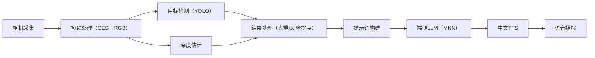

# Blind Guide on Android

<p align="center">
  
</p>

<p align="center">
  <a href="LICENSE"></a>
  <a href="https://app.roboflow.com/blindaidproject"></a>
</p>

> **TL;DR**：一款移动端离线实时导盲系统，通过 PC 端训练的目标检测、深度估计与语言模型，经量化优化后部署于 Android 设备。整合 **YOLO 实时目标检测**、**单目深度估计** 与 **MNN 端侧 LLM + 中文 TTS**，实现“看见→理解→播报”全流程离线闭环。核心代码位于 `app/`，中文 TTS 模块独立封装于 `chinesettsmodule/`。


## 项目亮点

- **全离线运行**：无需网络依赖，保护用户隐私，确保无延迟响应
- **多模型协同**：目标检测（定位物体）+ 深度估计（测算距离）+ LLM（语义理解）+ TTS（语音播报）
- **轻量化部署**：通过 MNN 框架优化模型，适配中低端 Android 设备
- **开源数据集**：基于 Roboflow 平台构建的导盲场景专用数据集，覆盖室内外常见障碍物与环境元素


## 开源数据集（Roboflow）

本项目使用的模型训练数据托管于 [Roboflow 平台](https://app.roboflow.com/blindaidproject)，我们的项目 ID：blind_aid_yolov8n-o7fs2（欢迎在 roboflow 社区获取），数据集包含：
- **场景覆盖**：室外（街道、路口、人行道）、特殊场景（盲道、红绿灯）
- **目标类别**：障碍物（台阶、栏杆）、可交互物体（门把手、电梯按钮）、交通元素（斑马线、指示牌）等 30 类
- **数据规模**：总计 5,000+ 标注图像，含不同光照、天气条件下的样本，增强模型鲁棒性
- **标注格式**：支持 YOLO、COCO 等主流格式，可直接用于模型训练

> 数据集支持免费下载与二次标注，欢迎社区贡献新场景数据以提升模型泛化能力。


## 目录结构

```
.
├─ app/                               # 主应用模块（核心业务逻辑）
│  ├─ src/main/
│  │  ├─ assets/models/               # 模型资源目录
│  │  │  ├─ Qwen3-0.6B-MNN/          # LLM模型及配置
│  │  │  └─ tts/                      # 中文TTS资源
│  │  ├─ jniLibs/arm64-v8a/           # 原生库（MNN、推理引擎等）
│  │  ├─ java/com/...                 # Java/Kotlin业务代码
│  │  └─ res/                         # 界面资源
│  └─ libs/                           # 第三方依赖库
├─ chinesettsmodule/                  # 中文TTS独立模块
└─ 构建配置文件（gradle/、settings.gradle等）
```


## 系统架构



**核心模块功能**：
- **GLRender**：相机帧格式转换与分发，支持推理节流控制
- **检测与深度模块**：封装模型推理接口，输出目标坐标与距离信息
- **结果处理**：跨帧去重、风险评分（近距高风险优先）、Top-K筛选
- **LLM交互**：生成自然语言描述（如“前方3米有台阶，左侧1米有扶手”）
- **TTS播报**：文本转语音，支持音频焦点管理避免干扰


## 快速开始

### 1. 环境准备
- Android Studio Koala+（AGP 8.x）
- NDK r25c+
- 支持 `arm64-v8a` 的 Android 设备（Android 8.0+，建议 10+）

### 2. 模型部署
1. 从 [Releases](...) 下载模型压缩包
2. 解压至 `app/src/main/assets/models/`，目录结构如下：
   ```
   assets/models/
   ├─ Qwen3-0.6B-MNN/（LLM模型）
   └─ tts/（TTS资源）
   ```

### 3. 构建与运行
1. 克隆仓库并打开项目：
   ```bash
   git clone <仓库地址> && cd BlindGuide-Android
   ```
2. 连接 Android 设备，点击 Android Studio "Run" 按钮
3. 首次启动需授予相机与音频权限，即可开始使用


## 性能调优建议

| 设备类型 | 输入尺寸  | Top-K | LLM精度      | 节流间隔 |
|----------|-----------|-------|--------------|----------|
| 低端设备 | 288×512   | 2-3   | q8           | 1.5-2s   |
| 中端设备 | 384×640   | 3-4   | q8+16bit头   | 1s       |
| 高端设备 | 448×800   | 5     | 16bit        | 0.5-1s   |

> 可在设置页调整参数，平衡检测精度与响应速度


## 常见问题（FAQ）

- **Q1：模型文件过大导致安装失败？**  
  A1：采用分包策略，将模型放在服务器，首次启动时下载至 `getExternalFilesDir()`。

- **Q2：相机预览黑屏？**  
  A2：确认设备相机功能正常并授予权限，Android 13+ 需在 Manifest 中声明 `android.permission.CAMERA`。

- **Q3：语音无输出？**  
  A3：检查媒体音量与音频权限，尝试重启应用。

- **Q4：推理闪退？**  
  A4：确保 `tokenizer.txt` 为 LF 格式，模型与 MNN 版本匹配。


## 开发计划（Roadmap）

- [x] 核心模型端侧整合与基础功能验证
- [x] 风险排序与 LLM 推理门控优化
- [ ] 避障功能与地图导航功能相结合
- [ ] 智能语音交互


## 致谢

- [Alibaba MNN](https://github.com/alibaba/MNN)：端侧深度学习框架支持
- [ChineseTtsTflite](https://github.com/benjaminwan/ChineseTtsTflite)：中文TTS基础实现
- [YOLO-Depth-Estimation-for-Android](https://github.com/DakeQQ/YOLO-Depth-Estimation-for-Android)：目标检测与深度估计参考
- [Roboflow 平台](https://app.roboflow.com)：数据集管理与标注支持
- [LLaMA Factory](https://github.com/hiyouga/LLaMA-Factory)：语言模型微调训练工具支持，助力端侧LLM适配导盲场景语义理解任务
- [Ultralytics HUB](https://hub.ultralytics.com/)：提供YOLO模型的云端训练资源与可视化工具，支持目标检测模型训练

通过整合以上开源工具与平台的能力，本项目得以高效实现从模型训练到端侧部署的全流程闭环，在此向所有开源贡献者表示感谢。


## 贡献指南

欢迎通过以下方式参与项目：
1. 提交 Issue 反馈 bug 或建议（附设备型号与复现步骤）
2. 优化模型精度/速度、扩展 TTS 语音风格、适配更多机型
3. 贡献新场景数据集至 Roboflow 仓库

提交 PR 前请确保代码符合 Google Java/Kotlin 编码规范，并更新相关文档。


## License

本项目基于 [Apache License 2.0](https://www.apache.org/licenses/LICENSE-2.0) 开源。
