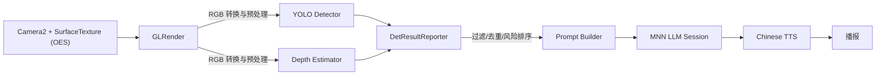

# blind guide on Android
1
> **TL;DR**：一个将 **YOLO 实时目标检测**、**单目深度估计** 与 **MNN 端侧 LLM + 中文 TTS** 整合到 **同一个 Android App** 的示例工程，支持离线运行，专注“看见→理解→播报”的闭环。在本仓库中：业务代码位于 `app/`，中文 TTS 作为独立模块位于 `chinesettsmodule/`，模型与本地库请按本文目录说明放置。

---

## 仓库状态

* 默认分支：`master`
* 主要模块：`app/`、`chinesettsmodule/`
* 版本发布：在 **Releases** 中提供模型压缩包（见右栏 *Releases*），可直接下载后解压到 `assets/models/` 对应目录。


---

## 目录结构

```
.
├─ app/                               # 主应用模块
│  ├─ src/main/
│  │  ├─ assets/models/
│  │  │  ├─ Qwen3-0.6B-MNN/          # LLM 目录（llm.mnn / llm.mnn.weight / config.json / tokenizer.*）
│  │  │  └─ tts/                      # 中文TTS所需资源（若有）
│  │  ├─ jniLibs/arm64-v8a/           # 本模块打包的 .so（libMNN.so / libmnnllm.so / 其它）
│  │  ├─ java/com/...                 # Java/Kotlin 代码
│  │  └─ res/                         # 资源
│  └─ libs/arm64-v8a/ort_1.21.0_qnn_2.32/ ...   # （可选）第三方本地库
├─ chinesettsmodule/                  # 中文 TTS 独立模块
│  └─ src/main/java/com/benjaminwan/chinesettsmodule/{tts,utils}/
├─ gradle/ , gradlew(.bat)            # Gradle Wrapper
├─ settings.gradle , build.gradle     # 顶层构建脚本
└─ README.md                          # 本文件
```


---

## 系统架构与数据流



**关键模块**：

* **GLRender**：相机帧从 OES 转 RGB，分发至 YOLO/DEPTH；带节流。
* **YOLO / Depth**：推理前后处理，封装为 Native/C++/MNN 或 Java/Kotlin 接口。
* **DetResultReporter**：跨帧去重、规则过滤、风险评分、Top‑K 选取，与 **LLM Busy** 联动。
* **LlmSimpleClient / LlmGate**：组装 Prompt，调用 MNN LLM 推理。
* **TTS（`chinesettsmodule`）**：中文语音合成与播放。


---

## 环境要求

* **Android Studio**：Koala+（AGP 8.x）
* **NDK**：r25c 或更新
* **ABI**：`arm64-v8a`
* **最低系统**：Android 8.0+（建议 10+）

---

## 构建配置（Gradle）

### 顶层 `settings.gradle`

```gradle
include(":app", ":chinesettsmodule")
```

### `app/build.gradle`（要点）

```gradle
plugins { id "com.android.application" }

android {
  namespace "com.example.mnnllmdemo"
  compileSdk 34

  defaultConfig {
    applicationId "com.example.mnnllmdemo"
    minSdk 26
    targetSdk 34
    ndk { abiFilters "arm64-v8a" }
  }

  buildTypes {
    debug { }
    release {
      minifyEnabled false
      // proguardFiles getDefaultProguardFile('proguard-android-optimize.txt'), 'proguard-rules.pro'
    }
  }

  packagingOptions {
    jniLibs { useLegacyPackaging true }
    resources { excludes += ["META-INF/**"] }
  }
}

dependencies {
  implementation project(":chinesettsmodule")
  // 其它依赖按需添加
}
```

### `chinesettsmodule/build.gradle`（要点）

```gradle
plugins { id "com.android.library" }

android {
  namespace "com.benjaminwan.chinesettsmodule"
  compileSdk 34
  defaultConfig { minSdk 21 targetSdk 34 }
  packagingOptions { jniLibs { useLegacyPackaging true } }
}
```

> 若出现“重复 .so”冲突，优先保留 `app/src/main/jniLibs/arm64-v8a/` 的版本，删除根目录 `lib/arm64-v8a/` 的冗余文件或在 `packagingOptions` 中排除。

---

## 模型与资源放置

### 1) LLM（MNN）

将导出的模型与分词文件放入：

```
app/src/main/assets/models/Qwen3-0.6B-MNN/
  ├─ llm.mnn
  ├─ llm.mnn.weight            # 若有独立权重
  ├─ tokenizer.json | tokenizer.txt
  └─ config.json
```

示例 `config.json`：

```json
{
  "llm_model": "llm.mnn",
  "llm_weight": "llm.mnn.weight",
  "backend_type": "cpu",
  "thread_num": 2,
  "precision": "low",
  "memory": "low",
  "sampler_type": "mixed",
  "mixed_samplers": ["penalty", "topK", "topP", "min_p", "temperature"],
  "penalty": 1.1,
  "temperature": 0.2,
  "topP": 0.9,
  "topK": 20,
  "min_p": 0
}
```


### 2) 中文 TTS

如模块需要额外词典/资源，请置于：`app/src/main/assets/models/tts/` 或 `chinesettsmodule` 自身的 `assets/`（取决于你的实现）。

### 3) Native 库

把所有随 APK 分发的 `.so` 放在各自模块的 `src/main/jniLibs/arm64-v8a/` 下，例如：

```
app/src/main/jniLibs/arm64-v8a/
  ├─ libMNN.so
  ├─ libmnnllm.so
  ├─ libtts_xxx.so
  └─ ...
```


## 运行与操作

* 首次启动会打印关键初始化日志（如 `DetResultReporter.init()`）。
* 主界面：相机预览 + 推理开关；设置页可调整：

  * YOLO/Depth 的节流/冷却（节约算力）
  * LLM Busy 行为（合并/覆盖/排队）
* LLM 输出采用 **非流式**，返回后统一触发 TTS 播报。

---

## 检测后处理与播报策略

### 1) 过滤与去重

* **置信度阈值**、**极小框过滤**、**极近/极远过滤**
* **边缘小框抑制**：中心位于左右边缘且面积过小的框予以剔除
* **类别多样性上限**：每类最多 N 个（默认 1，可配 CAP2/CAP3）
* **区域过滤**：左右/前后区域面积或距离不达阈值的目标剔除

### 2) 风险评分与 Top‑K

* 对每个目标计算综合风险分（距离、面积、类别权重等）
* 过滤低于 `RISK_MIN_FOR_INPUT` 的项；
* 取 **Top‑K** 并以 **近→远** 排序，作为 LLM 输入摘要；

### 3) LLM Busy 门控

* 推理期间合并/覆盖待处理批次，避免竞争和抖动；
* 可与 YOLO/Depth 节流一起控制整体延迟。

### 4) Prompt 组织（中文优先）

* 按“类别/置信度/距离/方位”生成短句；
* 去重 + Top‑K 控制 token，保证端侧低延迟；

### 5) TTS 播报

* LLM 返回完整文本后一次性播报；
* 通过音频焦点减少与系统/他应用冲突；
  

---

## 性能与调参建议

* **输入尺寸**：288×512（快）/384×640（折中）/448×800（慢）
* **Top‑K**：通常 3–5，继续增大收益递减且拖慢 LLM
* **量化**：LLM `q8` 主干 + `lm 16bit` 头是较稳方案；
* **线程与拷贝**：尽量减少 OES→CPU 读回；推理与 TTS 分线程并使用门控

---

## 常见问题（FAQ）

**Q1. APK 里找不到 `libMNN.so`？**
请确认放在 `app/src/main/jniLibs/arm64-v8a/`，并且 `abiFilters` 仅包含 `arm64-v8a`（或与你设备一致）。

**Q2. 构建时报 `undefined symbol: MNN::DIFFUSION::Diffusion::load()`？**
MNN 版本或转换工具不匹配，确保转换器与运行时版本一致，且你的 `libMNN.so` 含所需算子实现。

**Q3. LLM 输出被打断或不播报？**
检查 Busy 门控与批次合并逻辑；确保 TTS 的触发点在 LLM 完整返回之后。

**Q4. OOM / 卡顿？**
降低模型尺寸/输入分辨率、增大节流间隔、缩小 Top‑K、精简 Prompt、减少日志、避免任务堆积。

**Q5. 推理过程中闪退？**
将tokenizer.txt换为LF格式。

---

## Roadmap

* [x] YOLO + Depth + MNN LLM + 中文 TTS 端侧整合
* [x] 风险排序、LLM Busy 门控
* [ ] ARCore 融合（空间理解）
* [ ] Drone/多角度搜索与路径建议
* [ ] DepthAnything 直接距离标定工具
* [ ] 更丰富的可达性/安全级别提示词模板

---

## 致谢

* [Alibaba MNN](https://github.com/alibaba/MNN)
* [ChineseTtsTflite by @benjaminwan](https://github.com/benjaminwan/ChineseTtsTflite)
* [YOLO-Depth-Estimation-for-Android by @DakeQQ](https://github.com/DakeQQ/YOLO-Depth-Estimation-for-Android)
* 以及所有开源依赖的作者与贡献者 🙏

---

## License

**Apache-2.0**

